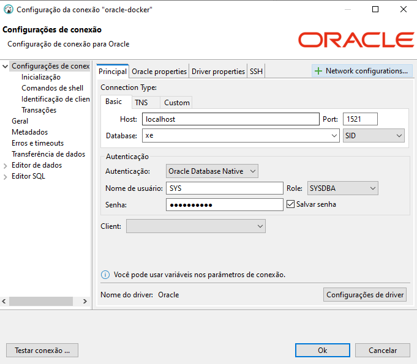

#### LINK's úteis 

Rodar oracle no docker:

https://medium.com/xp-inc/dica-r%C3%A1pida-criando-base-de-dados-oracle-vers%C3%A3o-21-3-0-no-docker-357b05754b84

Rodar o docker compose

docker compose up

como conectar um aplicação em spring boot em três banos diferentes(mongodb, oracle e postgress) usando datasource e springdata jpa

###### emular o oracle no docker

https://medium.com/xp-inc/dica-r%C3%A1pida-criando-base-de-dados-oracle-vers%C3%A3o-21-3-0-no-docker-357b05754b84

jdbc:oracle:thin:@localhost:1521/xe
jdbc:oracle:thin:@[nome_do_servidor]:[porta]/[SID_do_banco]